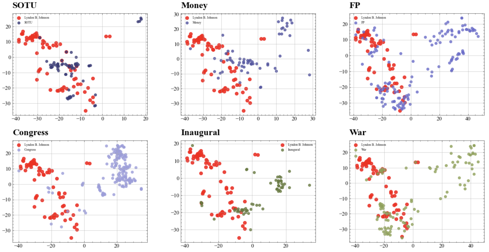
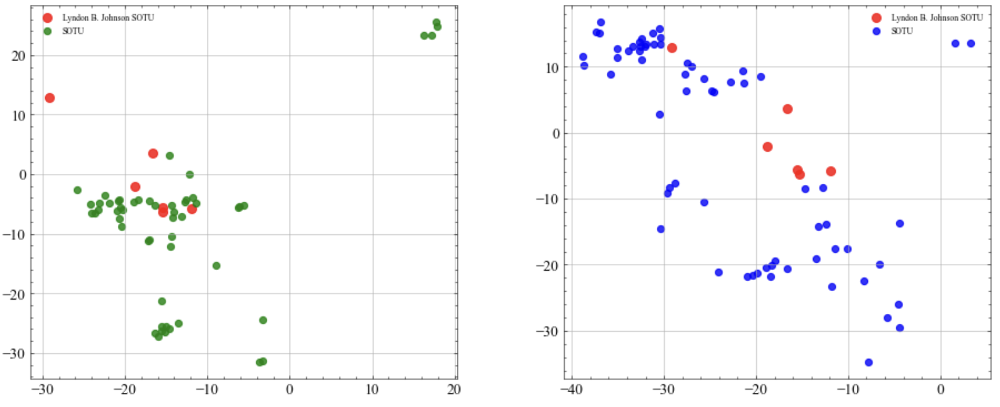
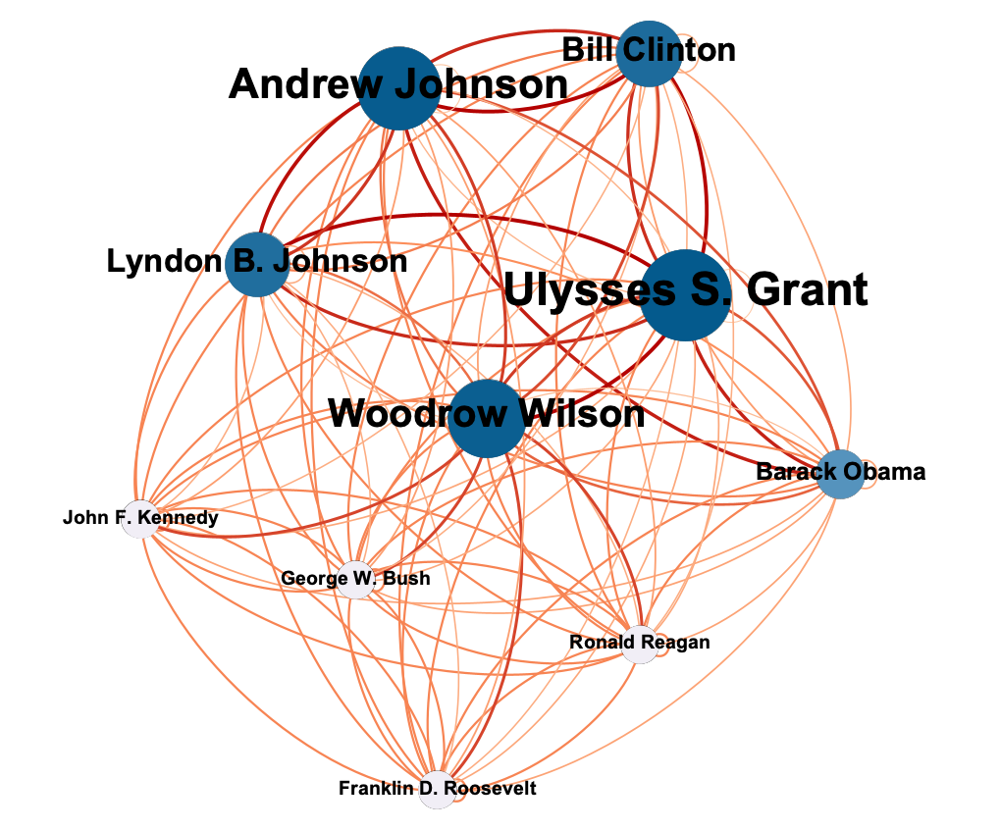

## __May 12, 2022__

- I did two version of document embedding via FastText. The first is based on a self-trained word2vec model on the political speech corpus and the other one used a large pre-trained word2vec model to build the doc2vec embedding in our context.

- Data was cleaned by omiting contexts and presidents that contain very limited numbers of speeches.

- I first visualized the distribution of Lyndon B.Jonson's speeches and the distributions of all the cleaned six contexts.

- I further visualized the distribution of Lyndon B.Jonson's SOTU speeches and the distribution of other presidents' SOTU speeches. We can see how Lyndon B.Jonson's SOTU speeches deviate from the "common" SOTU speeches.

- I built a ward cluster distance measurement. This measurement can help us to quantify the deviation of speeches from "common" speeches that share similar features. For example, given by the same president or under the same context.

- I calculated the distance between each president's congress speeches and the other presidents' congress speeches. This is a distance matrix. I converted it to a similarity matrix. Then I have the network plot below. Large and dark nodes are presidents whose congress talks are similar to other presidents. Small nodes represent presidents whose congress speeches are different from the others.

